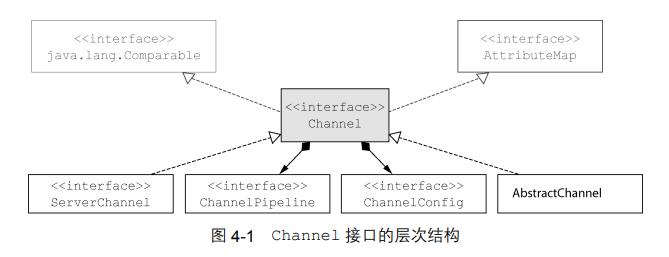
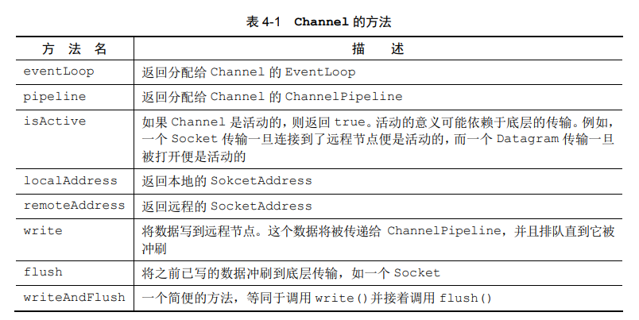
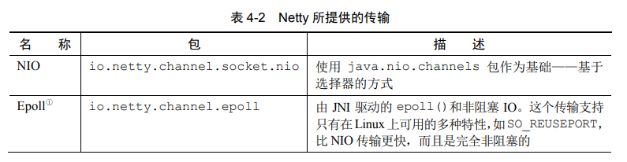
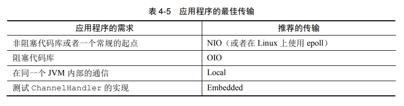

## 第 4 章  传输

如果你有 Java 网络编程的经验，那么你可能已经发现，在某些时候，你需要支撑比预期多很多的并发连接。如果你随后尝试从阻塞传输切换至非阻塞传输，那么你可能会因为这两种网络 API 的截然不同而遇到问题

然而，Netty 为它所有的传输实现了一个通用的 API，这使得这种转换比你直接使用 JDK 所能够达到的简单得多。所产生的代码不会被实现的细节所污染，而你也不需要在你的整个代码库上进行广泛的重构。简而言之，你可以将时间花在其他更有成效的事情上

在本章中，我们将学习这个通用 API，并通过和 JDK 的对比来证明它及其简单易用。我们将阐述 Netty 自带的不同传输实现，以及它们各自使用的场景

### 1. 案例研究：传输迁移

我们将从一个应用程序开始我们对传输的学习，这个应用程序只简单地接受连接，向客户端写 "Hi!"，然后关闭连接

#### 1.1 不通过 Netty 使用 OIO 和 NIO

我们将介绍仅使用了 JDK API 的应用程序的 OIO 版本和 NIO 版本

未使用 Netty 的 BIO 版本：

```java
package com.zhengjianting.nia.chapter4;

import java.io.IOException;
import java.io.OutputStream;
import java.net.ServerSocket;
import java.net.Socket;
import java.nio.charset.StandardCharsets;

public class PlainOioServer {
    public void server(int port) throws IOException {
        final ServerSocket socket = new ServerSocket(port);
        try {
            for (;;) {
                final Socket clientSocket = socket.accept();
                System.out.println("Accepted connection from " + clientSocket);
                new Thread(new Runnable() {
                    @Override
                    public void run() {
                        OutputStream out;
                        try {
                            out = clientSocket.getOutputStream();
                            out.write("Hi!\r\n".getBytes(StandardCharsets.UTF_8));
                            out.flush();
                            clientSocket.close();
                        } catch (IOException e) {
                            e.printStackTrace();
                        } finally {
                            try {
                                clientSocket.close();
                            } catch (IOException e) {
                                e.printStackTrace();
                            }
                        }
                    }
                }).start();
            }
        } catch (IOException e) {
            e.printStackTrace();
        }
    }
}
```

未使用 Netty 的 NIO 版本：

```java
package com.zhengjianting.nia.chapter4;

import java.io.IOException;
import java.net.InetSocketAddress;
import java.nio.ByteBuffer;
import java.nio.channels.SelectionKey;
import java.nio.channels.Selector;
import java.nio.channels.ServerSocketChannel;
import java.nio.channels.SocketChannel;
import java.util.Iterator;
import java.util.Set;

public class PlainNioServer {
    public void server(int port) throws IOException {
        ServerSocketChannel serverChannel = ServerSocketChannel.open();
        serverChannel.configureBlocking(false);
        serverChannel.bind(new InetSocketAddress(port));

        Selector selector = Selector.open();
        serverChannel.register(selector, SelectionKey.OP_ACCEPT);

        final ByteBuffer msg = ByteBuffer.wrap("Hi!\r\n".getBytes());
        for (;;) {
            try {
                selector.select();
            } catch (IOException ex) {
                ex.printStackTrace();
                // handle exception
                break;
            }

            Set<SelectionKey> readyKeys = selector.selectedKeys();
            Iterator<SelectionKey> iterator = readyKeys.iterator();
            while (iterator.hasNext()) {
                SelectionKey key = iterator.next();
                iterator.remove();
                try {
                    if (key.isAcceptable()) {
                        ServerSocketChannel server = (ServerSocketChannel) key.channel();
                        SocketChannel client = server.accept();
                        client.configureBlocking(false);
                        client.register(selector, SelectionKey.OP_WRITE | SelectionKey.OP_READ, msg.duplicate());
                        System.out.println("Accepted connection from " + client);
                    }
                    if (key.isWritable()) {
                        SocketChannel client = (SocketChannel) key.channel();
                        ByteBuffer buffer = (ByteBuffer) key.attachment();
                        while (buffer.hasRemaining()) {
                            if (client.write(buffer) == 0) {
                                break;
                            }
                        }
                        client.close();
                    }
                } catch (IOException ex) {
                    key.cancel();
                    try {
                        key.channel().close();
                    } catch (IOException cex) {
                        // ignore on close
                    }
                }
            }
        }
    }

    public static void main(String[] args) throws IOException {
        new PlainNioServer().server(10526);
    }
}
```

可以看到，通过使用 JDK API 实现的 OIO 和 NIO 版本所做的事情完全相同，但是代码却截然不同。如果为了使用 NIO 而重写 OIO 的版本，几乎要修改所有的代码

#### 1.2 通过 Netty 使用 OIO 和 NIO

使用 Netty 的 OIO 版本：

```java
package com.zhengjianting.nia.chapter4;

import io.netty.bootstrap.ServerBootstrap;
import io.netty.buffer.ByteBuf;
import io.netty.buffer.Unpooled;
import io.netty.channel.*;
import io.netty.channel.oio.OioEventLoopGroup;
import io.netty.channel.socket.SocketChannel;
import io.netty.channel.socket.oio.OioServerSocketChannel;

import java.net.InetSocketAddress;
import java.nio.charset.StandardCharsets;

public class NettyOioServer {
    public void server(int port) throws Exception {
        final ByteBuf buf = Unpooled.unreleasableBuffer(Unpooled.copiedBuffer("Hi!\r\n", StandardCharsets.UTF_8));
        EventLoopGroup group = new OioEventLoopGroup();
        try {
            ServerBootstrap b = new ServerBootstrap();
            b.group(group)
                    .channel(OioServerSocketChannel.class)
                    .localAddress(new InetSocketAddress(port))
                    .childHandler(new ChannelInitializer<SocketChannel>() {
                        @Override
                        protected void initChannel(SocketChannel socketChannel) throws Exception {
                            socketChannel.pipeline().addLast(new ChannelInboundHandlerAdapter() {
                                @Override
                                public void channelActive(ChannelHandlerContext ctx) throws Exception {
                                    ctx.writeAndFlush(buf.duplicate()).addListener(ChannelFutureListener.CLOSE);
                                }
                            });
                        }
                    });
            ChannelFuture f = b.bind().sync();
            f.channel().closeFuture().sync();
        } finally {
            group.shutdownGracefully();
        }
    }

    public static void main(String[] args) throws Exception {
        new NettyOioServer().server(10526);
    }
}
```

使用 Netty 的 NIO 版本：

```java
package com.zhengjianting.nia.chapter4;

import io.netty.bootstrap.ServerBootstrap;
import io.netty.buffer.ByteBuf;
import io.netty.buffer.Unpooled;
import io.netty.channel.*;
import io.netty.channel.nio.NioEventLoopGroup;
import io.netty.channel.socket.SocketChannel;
import io.netty.channel.socket.nio.NioServerSocketChannel;

import java.net.InetSocketAddress;
import java.nio.charset.StandardCharsets;

public class NettyNioServer {
    public void server(int port) throws Exception {
        final ByteBuf buf = Unpooled.unreleasableBuffer(Unpooled.copiedBuffer("Hi!\r\n", StandardCharsets.UTF_8));
        EventLoopGroup group = new NioEventLoopGroup(); // OioEventLoopGroup -> NioEventLoopGroup
        try {
            ServerBootstrap b = new ServerBootstrap();
            b.group(group)
                    .channel(NioServerSocketChannel.class) // OioServerSocketChannel -> NioServerSocketChannel
                    .localAddress(new InetSocketAddress(port))
                    .childHandler(new ChannelInitializer<SocketChannel>() {
                        @Override
                        protected void initChannel(SocketChannel socketChannel) throws Exception {
                            socketChannel.pipeline().addLast(new ChannelInboundHandlerAdapter() {
                                @Override
                                public void channelActive(ChannelHandlerContext ctx) throws Exception {
                                    ctx.writeAndFlush(buf.duplicate()).addListener(ChannelFutureListener.CLOSE);
                                }
                            });
                        }
                    });
            ChannelFuture f = b.bind().sync();
            f.channel().closeFuture().sync();
        } finally {
            group.shutdownGracefully();
        }
    }

    public static void main(String[] args) throws Exception {
        new NettyNioServer().server(10526);
    }
}
```

可以看到，使用 Netty 从 OIO 传输切换到 NIO 传输只需要改动注释的那两行，因为 Netty 为每种传输的实现都暴露了相同的 API，所以无论选用哪一种传输的实现，代码都几乎不受影响

#### 2. 传输 API

传输 API 的核心是 interface Channel，它被用于所有的 I/O 操作。Channel 类的层次结构如图所示：



每个 Channel 都将会被分配一个 ChannelPipeline 和 ChannelConfig. ChannelConfig 包含了该 Channel 的所有配置设置，并且支持热更新

除了访问所分配的 ChannelPipeline 和 ChannelConfig 之外，也可以利用 Channel 的其他方法，其中最重要的列举在下表：



Netty 的 Channel 实现是线程安全的，以下代码展示了一个多线程写数据的简单例子，消息将会被保证按顺序发送

```java
final Channel channel = ...;
final ByteBuf buf = Unpooled.copiedBuffer("your data", CharsetUtil.UTF_8).retain();
Runnable writer = new Runnable() {
    @Override
    public void run() {
        channel.writeAndFlush(buf.duplicate());
    }
};
Executor executor = Executors.newCachedThreadPool();

// write in one thread
executor.execute(writer);

// write in another thread
executor.execute(writer);
```

### 3. 内置的传输

Netty 内置了一些可开箱即用的传输。因为并不是它们所有的传输都支持每一种协议，所有你必须选择一个和你的应用程序所使用的协议相容的传输，下表展示了所有 Netty 提供的传输：




### 4. 传输的用例



```tex
零拷贝 (zero-copy) 是一种目前只有在使用 NIO 和 Epoll 传输时才可使用的特性。它使你可以快速高效地将数据从文件系统移动到网络接口, 而不需要将其从内核空间复制到用户空间, 其在像 FTP 或者 HTTP 这样的协议中可以显著地提升性能。但是, 并不是所有的操作系统都支持这一特性。特别地, 它对于实现了数据加密或者压缩的文件系统是不可用的 ———— 只能传输文件的原始内容。反过来说, 传输已被加密的文件则不是问题。
```
