## 第 5 章  ByteBuf

Netty 使用 ByteBuf 代替 Java NIO 提供的 ByteBuffer，既解决了 JDK API 的局限性，又为网络应用程序的开发者提供了更好的 API

### 1. ByteBuf 的 API

Netty 的数据处理 API 通过两个组件暴露 —— abstract class ByteBuf 和 interface ByteBufHolder，下面是一些 ByteBuf API 的优点：

- 它可以被用户自定义的缓冲区类型扩展
- 通过内置的复合缓冲区类型实现了透明的零拷贝
- 容量可以按需增长 ( 类似于 JDK 的 StringBuilder )
- 在读和写这两种模式之间切换不需要调用 ByteBuffer 的 flip() 方法
- 读和写使用了不同的索引
- 支持方法的链式调用
- 支持引用计数
- 支持池化

### 2. ByteBuf 类 —— Netty 的数据容器

#### 2.1 它是如何工作的

ByteBuf 维护了两个不同的索引：一个用于读取，一个用于写入，下图展示了一个空 ByteBuf 的布局结构和状态：

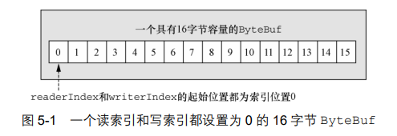

名称以 read 或者 write 开头的 ByteBuf 方法，将会推进其对应的索引；而名称以 set 或者 get 开头的方法在其传入的索引参数上进行操作，不会改变 ByteBuf 的索引

#### 2.2 ByteBuf 的使用模式

**堆缓冲区**

最常用的 ByteBuf 模式是将数据存储在 JVM 的堆空间中。这种模式被称为支撑数组 ( backing array )，它能在没有使用池化的情况下提供快速的分配和释放。这种方式非常适合于有遗留的数据需要处理的情况

```java
ByteBuf heapBuf = ...;
if (heapBuf.hasArray()) {
    byte[] array = heapBuf.array();
    int offset = heapBuf.arrayOffset() + heapBuf.readerIndex();
    int length = heapBuf.readableBytes();
    handleArray(array, offset, length);
}
```

**直接缓冲区**

直接缓冲区是另外一种 ByteBuf 模式。我们期望用于对象创建的内存分配永远都来自于堆中，但这并不是必须的 —— NIO 在 JDK 1.4 中引入的 ByteBuffer 类允许 JVM 实现通过本地调用来分配内存。这主要是为了避免在每次调用本地 I/O 操作之前 ( 或者之后 ) 将缓冲区的内容复制到一个中间缓冲区 ( 或者从中间缓冲区把内容复制到缓冲区 )

ByteBuffer 的 Javadoc 明确指出：直接缓冲区的内容将驻留在常规的会被垃圾回收的堆之外。这也就解释了为何直接缓冲区对于网络传输是理想的选择。如果你的数据包含在一个在堆上分配的缓冲区中，那么在通过套接字发送它之前，JVM 将会在内部把你的缓冲区复制到一个直接缓冲区中

直接缓冲区的主要缺点是，相对于基于堆的缓冲区，它们的分配和释放都较为昂贵。如果你正在处理遗留代码，你也可能会遇到另外一个缺点：因为数据不是在堆上，所以你不得不进行一次复制

```java
// 访问直接缓冲区的数据
ByteBuf directBuf = ...;
if (!directBuf.hasArray()) { // 检查 ByteBuf 是否由数组支撑, 如果不是, 则这是一个直接缓冲区
    int length = directBuf.readableBytes();
    byte[] array = new byte[length];
    directBuf.getBytes(directBuf.readerIndex(), array);
    handleArray(array, 0, length);
}
```

显然，与堆缓冲区相比，这涉及的工作更多。因此，如果事先知道容器中的数据将会被作为数组来访问，你可能更愿意使用堆内存

**复合缓冲区**

复合缓冲区为多个 ByteBuf 提供一个聚合视图。你可以根据需要添加或者删除 ByteBuf 实例，这是一个 JDK 的 ByteBuffer 实现完全缺失的特性

Netty 通过一个 ByteBuf 子类 —— CompositeByteBuf 实现了这个模式，它提供了一个将多个缓冲区表示为单个合并缓冲区的虚拟表示

```tex
CompositeByteBuf 中的 ByteBuf 实例可能同时包含直接内存分配和非直接内存分配。如果其中只有一个实例, 那么对 CompositeByteBuf 上的 hasArray() 方法的调用将返回该组件上的 hasArray() 方法的值; 否则它将返回 false
```

```java
// 使用 CompositeByteBuf 的复合缓冲区模式
CompositeByteBuf messageBuf = Unpooled.compositeBuffer();
ByteBuf headerBuf = ...;
ByteBuf bodyBuf = ...;
messageBuf.addComponents(headerBuf, bodyBuf);

messageBuf.removeComponent(0);
for (ByteBuf buf : messageBuf) {
    System.out.println(buf.toString());
}
```

CompositeByteBuf 可能不支持访问其支撑数组，因此访问 CompositeByteBuf 中的数据类似于 ( 访问 ) 直接缓冲区的模式，如以下代码所示

```java
CompositeByteBuf compBuf = Unpooled.compositeBuffer();
int length = compBuf.readableBytes();
byte[] array = new byte[length];
compBuf.getBytes(compBuf.readerIndex(), array);
handleArray(array, 0, length);
```

### 3. 字节级操作

#### 3.1 随机访问索引

如同在普通的 Java 字节数组中一样，ByteBuf 的索引是从零开始的：第一个字节的索引是 0，最后一个字节的索引是 capacity() - 1

```java
// 访问数据
ByteBuf buffer = ...;
for (int i = 0; i < buffer.capacity(); i++) {
    byte b = buffer.getByte(i);
    System.out.println((char) b);
}
```

需要注意的是，使用那些需要一个索引作为参数的方法来访问数据既不会改变 readerIndex 也不会改变 writerIndex. 如果有需要，可以通过调用 readerIndex(index) 或者 writerIndex(index) 来手动移动这两者

#### 3.2 顺序访问索引

ByteBuf 同时具有读索引和写索引，下图展示了 ByteBuf 是如何被它的两个索引划分成 3 个区域的

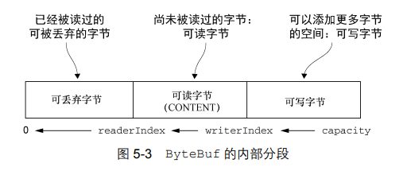

#### 3.3 可丢弃字节

通过调用 discardReadBytes() 方法可以回收上图中的可丢弃字节，结果如下图所示

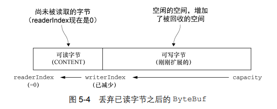

在调用 discardReadBytes() 之后，对可写分段的内容并没有任何的保证；而且这个方法可能会导致内存复制，因此建议只有在真正需要的时候才调用该方法，例如，当内存非常宝贵的时候

#### 3.4 可读字节

ByteBuf 的可读字节分段存储了实际数据。新分配的、包装的或者复制的缓冲区的默认的 readerIndex 值为 0. 任何名称以 read、skip 开头的操作分别会检索、跳过位于当前 readerIndex 的数据，并且将它增加已读字节数

```java
// 读取所有数据
while (buffer.isReadable()) {
    System.out.println(buffer.readByte());
}
```

#### 3.5 可写字节

可写字节分段是指一个拥有未定义内容的、写入就绪的内存区域。新分配的缓冲区的 writerIndex 的默认值为 0. 任何名称以 write 开头的操作都将从当前的 writerIndex 处开始写数据，并将它增加已经写入的字节数

```java
// 写数据, 用随机整数值填充缓冲区, 直到它空间不足为止
ByteBuf buffer = ...;
while (buffer.writableBytes() >= 4) {
    buffer.writeInt(random.nextInt());
}
```

#### 3.6 索引管理

可以通过 markReaderIndex()、markWriterIndex()、resetReaderIndex()、resetWriterIndex() 来标记和重置 ByteBuf 的 readerIndex 和 writerIndex

可以通过 readerIndex(int) 或者 writerIndex(int) 来将索引移动到指定位置

可以通过 clear() 方法来将 readerIndex 和 writerIndex 都设置为 0. 注意，clear() 方法不会清除内存中的内容，它比 discardReadBytes() 轻量得多，因为它只是重置索引而不会复制任何的内存

#### 3.7 查找操作

在 ByteBuf 中有多种可以用来确定指定值的索引的方法。最简单的是使用 indexOf() 方法。较复杂的查找可以通过那些需要一个 ByteBufProcessor 作为参数的方法达成。这个接口只定义了一个方法：boolean process(byte value)，它将检查输入值是否是正在查找的值

ByteBufProcessor 针对一些常见的值定义了许多便利的方法：

```java
// 使用 ByteBufProcessor 来寻找 \r
ByteBuf buffer = ...;
int index = buffer.forEachByte(ByteBufProcessor.FIND_CR);
```

注：在 Netty 4.1.x 中，ByteBufProcessor 已经废弃，请使用 io.netty.util.ByteProcessor

#### 3.8 派生缓冲区

派生缓冲区为 ByteBuf 提供了以专门的方式来呈现其内容的视图。该类视图是通过以下方法被创建的：

- duplicate()
- slice()
- slice(int，int)
- Unpooled.unmodifiableBuffer(...)
- order(ByteOrder)
- readSlice(int)

这些方法都将返回一个新的 ByteBuf 实例，它具有自己的读索引、写索引和标记索引。其内部存储和 JDK 的 ByteBuffer 一样也是共享的。这使得派生缓冲区的创建成本是很低廉的，但是这也意味着，如果你修改了它的内容，也同时修改了其对应的源实例

```tex
ByteBuf 复制
如果需要一个现有缓冲区的真实副本，请使用 copy() 或者 copy(int, int) 方法。不同于派生缓冲区，由这个调用所返回的 ByteBuf 拥有独立的数据副本。
```

以下代码展示了如何使用 slice(int，int) 方法来操作 ByteBuf 的一个分段

```java
// 对 ByteBuf 进行切片
Charset utf8 = Charset.forName("UTF-8");
ByteBuf buf = Unpooled.copiedBuffer("Netty in Action rocks!", utf8);
ByteBuf sliced = buf.slice(0, 15);
System.out.println(sliced.toString(utf8));
buf.setByte(0, (byte) 'J');
assert buf.getByte(0) == sliced.getByte(0); // 将会成功, 因为数据是共享的, 对其中一个所做的更改对另外一个也是可见的
```

不同于 slice()，使用 copy() 方法将返回一个现有缓冲区的真实副本

```java
// 复制一个 ByteBuf
Charset utf8 = Charset.forName("UTF-8");
ByteBuf buf = Unpooled.copiedBuffer("Netty in Action rocks!", utf8);
ByteBuf copy = buf.copy(0, 15);
System.out.println(copy.toString(utf8));
buf.setByte(0, (byte) 'J');
assert buf.getByte(0) != copy.getByte(0); // 将会成功, 因为数据不是共享的
```

#### 3.9 读 / 写操作

有两种类别的读 / 写操作：

- get() 和 set() 操作，从给定的索引开始读写，不会更改缓冲区的索引
- read() 和 write() 操作，从给定的索引开始，并且会根据已经访问过的字节数对索引进行调整

下表列举了最常用的 get() 方法：

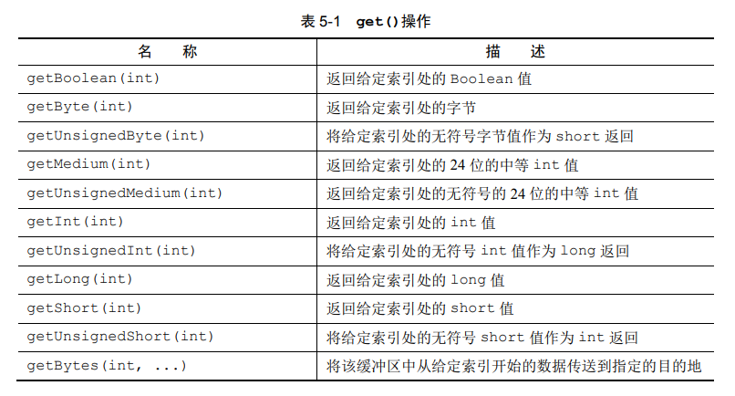

大多数的这些操作都有一个对应的 set() 方法：

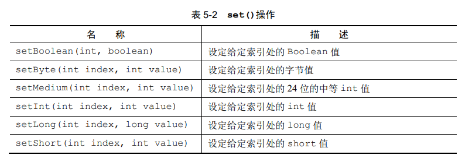

read() 操作作用于当前的 readerIndex，这些方法将用于从 ByteBuf 中读取数据：

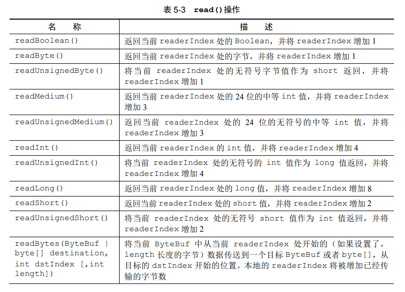

几乎每个 read() 方法都有对应的 write() 方法，用于将数据追加到 ByteBuf 中。注意，下表列出的方法的参数是需要写入的值，而不是索引值：

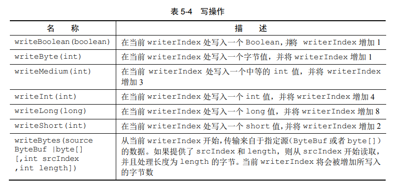

#### 3.10 更多的操作

下表列举了由 ByteBuf 提供的其他有用操作：

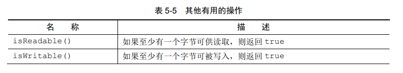

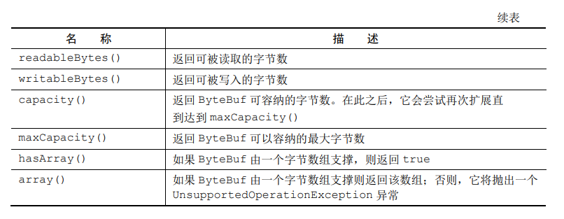

### 4. ByteBufHolder 接口

我们经常发现，除了实际的数据负载之外，我们还需要存储各种属性值。HTTP 响应便是一个很好的例子，除了表示为字节的内容，还包括状态码、cookie 等

为了处理这种常见的用例，Netty 提供了 ByteBufHolder. ByteBufHolder 也为 Netty 的高级特性提供了支持，如缓冲区池化，可以从池中借用 ByteBuf，并且在需要时自动释放

ByteBufHolder 只有几种用于访问底层数据和引用计数的方法：

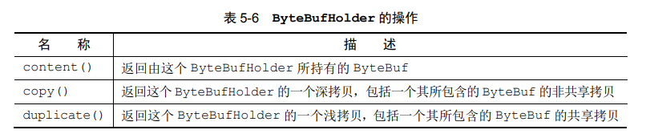

如果想要实现一个将其有效负载存储在 ByteBuf 中的消息对象，那么 ByteBufHolder 将是个不错的选择

### 5. ByteBuf 分配

#### 5.1 按需分配：ByteBufAllocator 接口

为了降低分配和释放内存的开销，Netty 通过 interface ByteBufAllocator 实现了 ( ByteBuf 的 ) 池化，它可以用来分配我们所描述过的任意类型的 ByteBuf 实例

下表列出了 ByteBufAllocator 提供的一些操作：

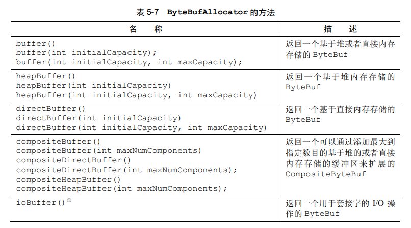

可以通过 Channel ( 每个都可以有一个不同的 ByteBufAllocator 实例 ) 或者绑定到 ChannelHandler 的 ChannelHandlerContext 获取一个到 ByteBufAllocator 的引用：

```java
// 从 Channel 获取一个到 ByteBufAllocator 的引用
Channel channel = ...;
ByteBufAllocator allocator = channel.alloc();

// 从 ChannelHandlerContext 获取一个到 ByteBufAllocator 的引用
ChannelHandlerContext ctx = ...;
ByteBufAllocator allocator = ctx.alloc();
```

Netty 提供了两种 ByteBufAllocator 的实现：PooledByteBufAllocator 和 UnpooledByteBufAllocator. 前者池化了 ByteBuf 的实例以提高性能并最大限度地减少内存碎片；后者的实现不池化 ByteBuf 实例，并且在每次它被调用时都会返回一个新的实例

#### 5.2 Unpooled 缓冲区

可能某些情况下，你未能获取一个到 ByteBufAllocator 的引用。对于这种情况，Netty 提供了一个简单的称为 Unpooled 的工具类，它提供了静态的辅助方法来创建未池化的 ByteBuf 实例：

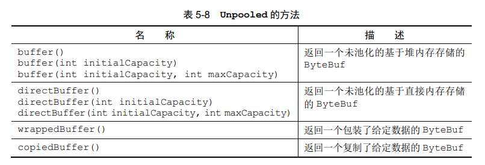

#### 6. 引用计数

引用计数是一种通过在某个对象所持有的资源不再被其他对象引用时释放该对象所持有的资源来优化内存使用和性能的技术。Netty 在第 4 版中为 ByteBuf 和 ByteBufHolder 引入了引用计数技术，它们都实现了 interface ReferenceCounted

一个 ReferenceCounted 实现的实例将通常以活动的引用计数为 1 作为开始，只要引用计数大于 0，就能保证对象不会被释放；当活动引用的数量减少到 0 时，该实例就会被释放

```java
// 引用计数
Channel channel = ...;
ByteBufAllocator allocator = channel.alloc();

ByteBuf buffer = allocator.directBuffer();
assert buffer.refCnt() == 1; // 检查引用计数是否为预期的 1
```

```java
// 释放引用计数的对象
ByteBuf buffer = ...;
boolean released = buffer.release(); // 减少到该对象的活动引用, 当减少到 0 时, 该对象被释放, 并返回 true
```