## 第 6 章  ChannelHandler 和 ChannelPipeline

### 1. ChannelHandler 家族

#### 1.1 Channel 的生命周期

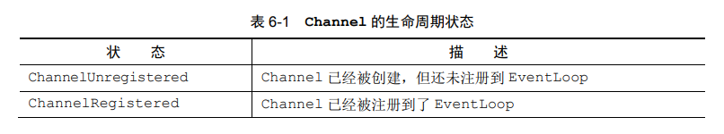

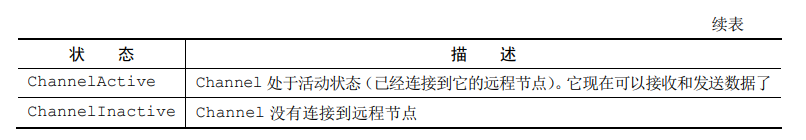

Channel 的正常生命周期如下图所示，当这些状态发生改变时，将会生成对应的事件。这些事件将会被转发给 ChannelPipeline 中的 ChannelHandler，其可以随后对它们做出响应

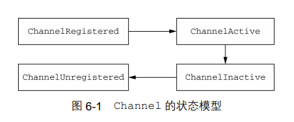

#### 1.2 ChannelHandler 的生命周期

下表列出了 interface ChannelHandler 定义的生命周期操作，在 ChannelHandler 被添加到 ChannelPipeline 中或者被从 ChannelPipeline 中移除时会调用这些操作。这些方法中的每一个都接受一个 ChannelHandlerContext 参数

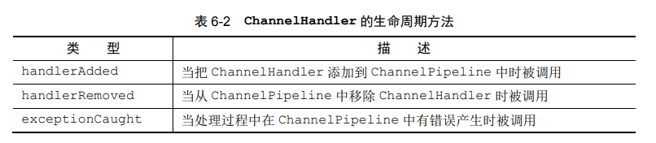

Netty 定义了下面两个重要的 ChannelHandler 子接口：

- ChannelInboundHandler —— 处理入站数据以及各种状态变化
- ChannelOutboundHandler —— 处理出站数据并且允许拦截所有的操作

#### 1.3 ChannelInboundHandler 子接口

下表列出了 interface ChannelInboundHandler 的生命周期方法。这些方法将会在数据被接收时或者其对应的 Channel 状态发生改变时被调用

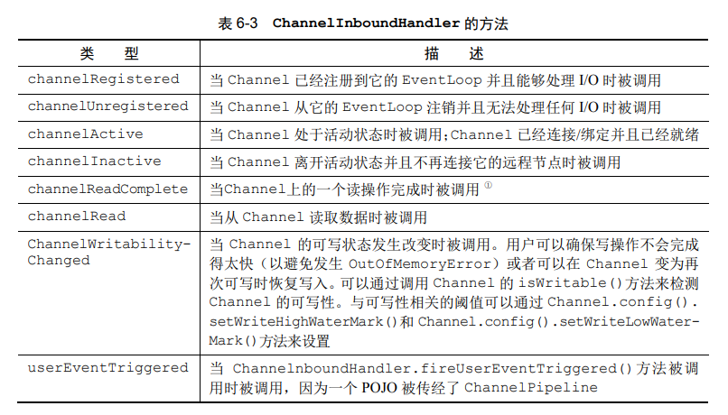

当某个 ChannelInboundHandler 的实现重写 channelRead() 方法时，它将负责显式地释放与池化的 ByteBuf 实例相关的内存。Netty 提供了一个实用方法 ReferenceCountUtil.release()：

```java
// 释放消息资源
@Sharable
public class DiscardHandler extends ChannelInboundHandlerAdapter {
    @Override
    public void channelRead(ChannelHandlerContext ctx, Object msg) {
        ReferenceCountUtil.release(msg); // 丢弃已接收的消息
    }
}
```

Netty 将使用 WARN 级别的日志消息记录未释放的资源，使得可以非常简单地在代码中发现违规的实例。但是以这种方法管理资源可能很繁琐，一个更加简单的方式是使用 SimpleChannelInboundHandler：

```java
// 使用 SimpleChannelInboundHandler
@Sharable
public class SimpleDiscardHandler extends SimpleChannelInboundHandler<Object> {
    @Override
    public void channelRead0(ChannelHandlerContext ctx, Object msg) {
        // No need to do anything special, 不需要任何显式的资源释放
    }
}
```

由于 SimpleChannelInboundHandler 会自动释放资源，所有你不应该存储指向任何消息的引用供将来使用，因为这些引用都将会失效

#### 1.4 ChannelOutboundHandler 接口

出站操作和数据将由 ChannelOutboundHandler 处理。它的方法将被 Channel、ChannelPipeline 以及 ChannelHandlerContext 调用

ChannelOutboundHandler 的一个强大的功能是可以按需推迟操作或者事件，这使得可以通过一些复杂的方法来处理请求。例如，如果到远程节点的写入被暂停了，那么你可以推迟冲刷操作并在稍后继续

下表显示了所有由 ChannelOutboundHandler 本身所定义的方法 ( 忽略了那些从 ChannelHandler 继承的方法 )：

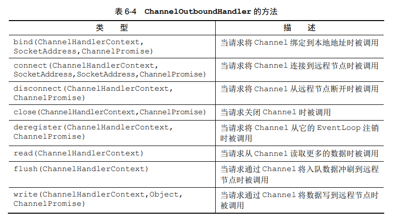

```tex
ChannelPromise 与 ChannelFuture
ChannelOutboundHandler 中的大部分方法都需要一个 ChannelPromise 参数, 以便在操作完成时得到通知。ChannelPromise 是 ChannelFuture 的一个子类, 其定义了一些可写的方法, 如 setSuccess() 和 setFailure(), 从而使 ChannelFuture 不可变。
```

#### 1.5 ChannelHandler 适配器

ChannelInboundHandlerAdapter 和 ChannelOutboundHandlerAdapter 分别提供了 ChannelInboundHandler 和 ChannelOutboundHandler 的基本实现

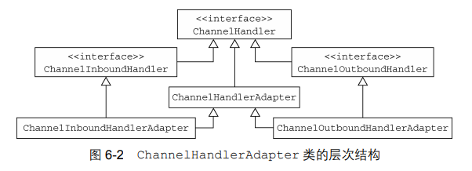

ChannelHandlerAdapter 还提供了实用方法 isSharable(). 如果其对应的实现被标注为 Sharable，那么这个方法将返回 true，表示它可以被添加到多个 ChannelPipeline 中

在 ChannelInboundHandlerAdapter 和 ChannelOutboundHandlerAdapter 中所提供的方法体调用了其相关联的 ChannelHandlerContext 上的等效方法，从而将事件转发到了 ChannelPipeline 中的下一个 ChannelHandler 中

你想要在自己的 ChannelHandler 中使用这些适配器类，只需要简单地扩展它们，并且重写那些你想要自定义的方法

#### 1.6 资源管理

没当通过调用 ChannelInboundHandler.channelRead() 或者 ChannelOutboundHandler.write() 方法来处理数据时，你都需要确保没有任何的资源泄漏。Netty 使用引用计数来处理池化的 ByteBuf，所有在完全使用完某个 ByteBuf 后，调整其引用计数是很重要的

为了帮助你诊断潜在的 ( 资源泄漏 ) 问题，Netty 提供了 class ResourceLeakDetector，它将对你应用程序的缓冲区分配做大约 1% 的采样来检测内存泄漏，相关的开销是非常小的，Netty 目前定义了 4 中泄漏检测级别：

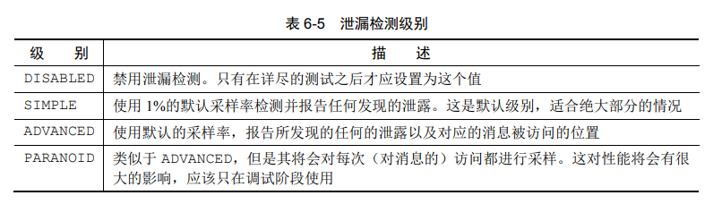

泄漏检测级别可以通过下面的 Java 系统属性设置为表中的一个值来定义：

```java
java -Dio.netty.leakDetectionLevel=ADVANCED
```

当 channelRead() 操作直接消费入站消息，也就是说，它不会通过调用 ChannelHandlerContext.fireChannelRead() 将入站消息转发给下一个 ChannelInboundHandler 时，以下代码展示了如何释放消息：

```java
// 消费并释放入站消息
@Sharable
public class DiscardInboundHandler extends ChannelInboundHandlerAdapter {
    @Override
    public void channelRead(ChannelHandlerContext ctx, Object msg) {
        ReferenceCountUtil.release(msg);
    }
}
```

由于消费入站数据是一项常规任务，所以 Netty 提供了一个特殊的被称为 SimpleChannelInboundHandler 的 ChannelInboundHandler 实现。这个实现会在消息被 channelRead0() 方法消费之后自动释放消息

在出站方向这边，如果你处理了 write() 操作并丢弃了一个消息，那么你也应该负责释放它，以下代码展示了一个丢弃所有的写入数据的实现

```java
// 丢弃并释放出站消息
@Sharable
public class DiscardOutboundHandler extends ChannelOutboundHandlerAdapter {
    @Override
    public void write(ChannelHandlerContext ctx, Object msg, ChannelPromise promise) {
        ReferenceCountUtil.release(msg);
        promise.setSuccess(); // 通知 ChannelPromise 数据已经被处理了
    }
}
```

重要的是，不仅要释放资源，还要通知 ChannelPromise. 否则可能会出现 ChannelFutureListener 收不到某个消息已经被处理了的通知的情况

总之，如果一个消息被消费或者丢弃了，并且没有传递给 ChannelPipeline 中的下一个 ChannelOutboundHandler，那么用户就有责任调用 ReferenceCountUtil.release(). 如果消息到达了实际的传输层，那么当它被写入时或者 Channel 关闭时，都将自动释放

### 2. ChannelPipeline 接口

ChannelPipeline 是一个拦截流经 Channel 的入站和出站事件的 ChannelHandler 实例链

每一个新创建的 Channel 都将会被分配一个新的 ChannelPipeline. 这项关联是永久性的，Channel 既不能附加另外一个 ChannelPipeline，也不能分离其当前的。在 Netty 组件的生命周期中，这是一项固定的操作，不需要开发人员的任何干预

根据事件的起源，事件将会被 ChannelInboundHandler 或者 ChannelOutboundHandler 处理。随后，通过调用 ChannelHandlerContext 实现，它将被转发给同一超类型的下一个 ChannelHandler

下图展示了一个典型的同时具有入站和出站 ChannelHandler 的 ChannelPipeline 的布局，如果一个入站事件被触发，它将被从 ChannelPipeline 的头部开始一直被传播到 ChannelPipeline 的尾端；一个出站 I/O 事件将从 ChannelPipeline 的最右边开始，然后向左传播

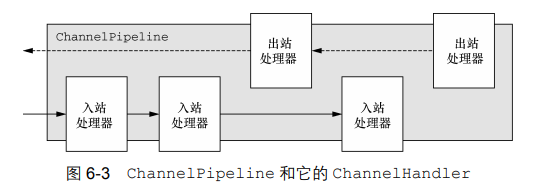

```tex
ChannelPipeline 相对论
Netty 总是将 ChannelPipeline 的入站口作为头部, 而将出站口作为尾端。因此, 如果将上图的处理器 (ChannelHandler) 从左到右进行编号, 那么第一个被入站事件看到的 ChannelHandler 将是 1, 而第一个被出站事件看到的 ChannelHandler 将是 5.
```

在 ChannelPipeline 传播事件时，它会测试 ChannelPipeline 中的下一个 ChannelHandler 的类型是否和事件的运动方向相匹配。如果不匹配，ChannelPipeline 将跳过该 ChannelHandler 并前进到下一个，直到它找到和该事件所期望的方向相匹配的为止

#### 2.1 修改 ChannelPipeline

下表展示了 ChannelPipeline 用于修改其布局的方法：

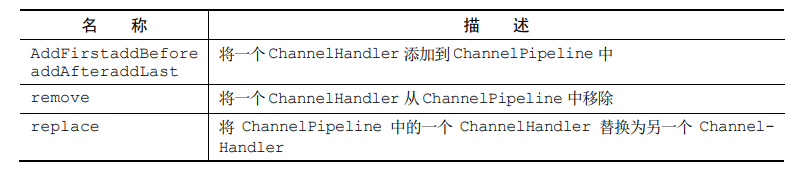

以下代码展示了这些方法的使用：

```java
ChannelPipeline pipeline = ...;
FirstHandler firstHandler = new FirstHandler();
pipeline.addLast("handler1", firstHandler);
pipeline.addLast("handler2", new SecondHandler());
pipeline.addLast("handler3", new ThirdHandler());

pipeline.remove("handler3"); // 通过名称移除 handler3
pipeline.remove("firstHandler"); // 通过引用移除 firstHandler
pipeline.replace("handler2", "handler4", new ForthHandler());
```

```tex
ChannelHandler 的执行和阻塞
通常 ChannelPipeline 中的每一个 ChannelHandler 都是通过它的 EventLoop (I/O 线程) 来处理传递给它的事件的。所以至关重要的是不要阻塞这个线程, 因为这会对整体的 I/O 处理产生负面的影响。
```

除了上述操作，还有别的通过类型或者名称来访问 ChannelHandler 的方法：

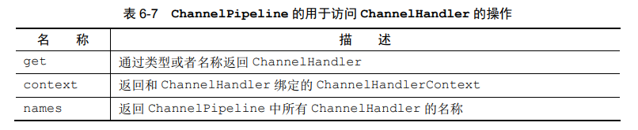

#### 2.2 触发事件

ChannelPipeline 的 API 公开了用于调用入站和出站操作的附加方法。下表列出了入站操作，用于通知 ChannelInboundHandler 在 ChannelPipeline 中所发生的事件

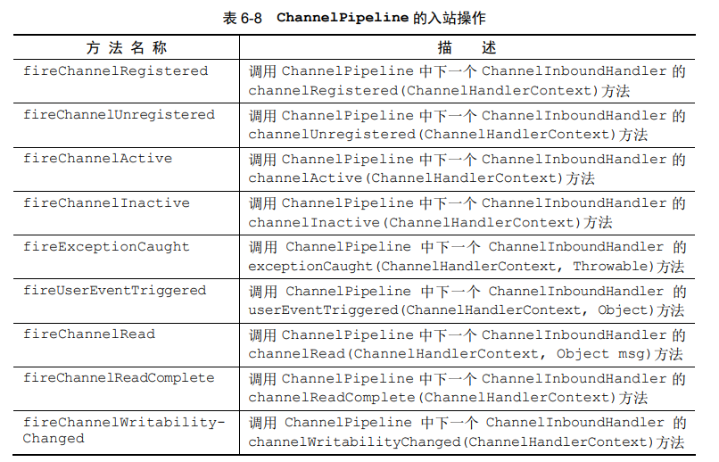

在出站这边，处理事件将会导致底层的套接字上发生一系列的动作，下表列出了 ChannelPipeline API 的出站操作

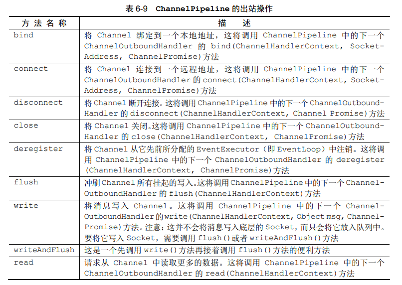

### 3. ChannelHandlerContext 接口

ChannelHandlerContext 代表了 ChannelHandler 和 ChannelPipeline 之间的关联。每当有 ChannelHandler 添加到 ChannelPipeline 中时，都会创建 ChannelHandlerContext. ChannelHandlerContext 的主要功能是管理它所关联的 ChannelHandler 和在同一个 ChannelPipeline 中的其他 ChannelHandler 之间的交互

ChannelHandlerContext 有很多的方法，其中一些方法也存在于 Channel 和 ChannelPipeline 本身上，但是有一点重要的不同。如果调用 Channel 或者 ChannelPipeline 上的这些方法，它们将沿着整个 ChannelPipeline 进行传播；而调用位于 ChannelHandlerContext 上的相同方法，则将从当前所关联 ChannelHandler 开始，并且只会传播给位于该 ChannelPipeline 中的下一个能够处理该事件的 ChannelHandler

下表对 ChannelHandlerContext API 进行了总结：

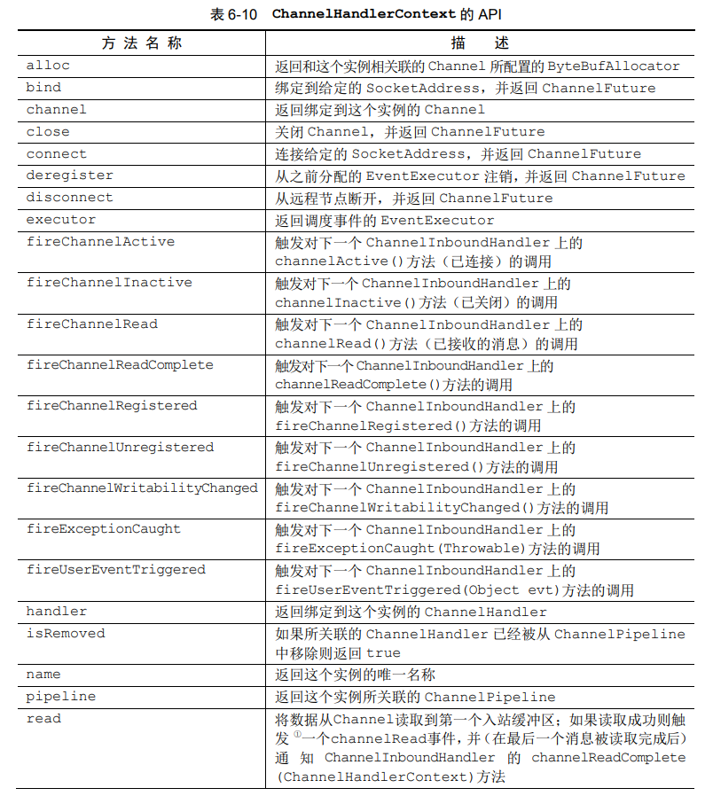

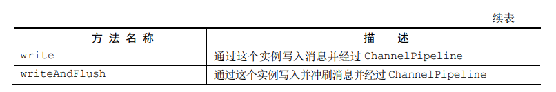

当使用 ChannelHandlerContext 的 API 时，请牢记以下两点：

- ChannelHandlerContext 和 ChannelHandler 之间的关联 ( 绑定 ) 是永远不会改变的，所以缓存对它的引用是安全的
- 相对于 Channel 和 ChannelPipeline 的同名方法，ChannelHandlerContext 的方法将产生更短的事件流，应该尽可能地利用这个特性来获得最大的性能

#### 3.1 使用 ChannelHandlerContext

下图展示了 Channel、ChannelPipeline、ChannelHandler 以及 ChannelHandlerContext 之间的关系：

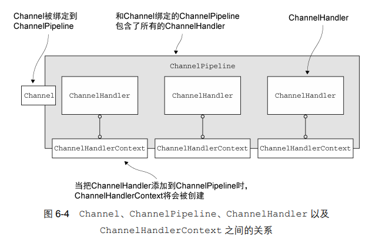

以下两端代码的事件流是一样的，都会导致写入事件从尾端到头部流经 ChannelPipeline

```java
// 从 ChannelHandlerContext 访问 Channel, 通过 Channel 写入缓冲区
ChannelHandlerContext ctx = ...;
Channel channel = ctx.channel();
channel.write(Unpooled.copiedBuffer("Netty in Action", CharsetUtil.UTF_8));
```

```java
// 从 ChannelHandlerContext 访问 ChannelPipeline, 通过 ChannelPipeline 写入缓冲区
ChannelHandlerContext ctx = ...;
ChannelPipeline pipeline = ctx.pipeline();
pipeline.write(Unpooled.copiedBuffer("Netty in Action", CharsetUtil.UTF_8));
```

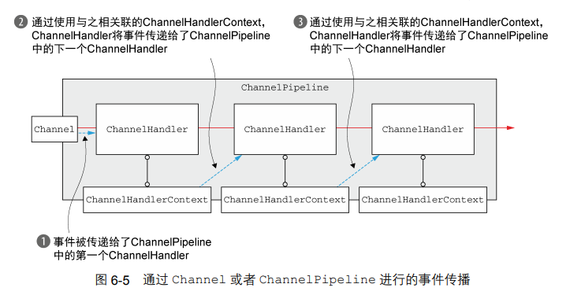

要想调用从某个特定的 ChannelHandler 开始的处理过程，必须获取到在该 ChannelHandler 之前的 ChannelHandler 所关联的 ChannelHandlerContext. 这个 ChannelHandlerContext 将调用和它所关联的 ChannelHandler 之后的 ChannelHandler

以下代码说明了这种用法：

```java
ChannelHandlerContext ctx = ...;
// write() 方法把缓冲区数据发送到下一个 ChannelHandler
ctx.write(Unpooled.copiedBuffer("Netty in Action", CharsetUtil.UTF_8));
```

如下图所示，消息将从下一个 ChannelHandler 开始流经 ChannelPipeline，绕过了所有前面的 ChannelHandler

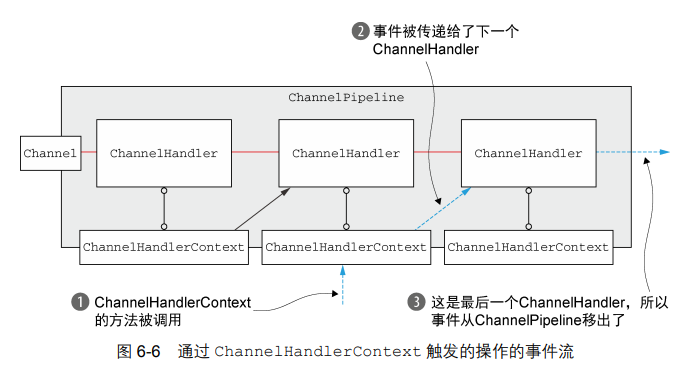

#### 3.2 ChannelHandler 和 ChannelHandlerContext 的高级用法

### 4. 异常处理

#### 4.1 处理入站异常

如果在处理入站事件的过程中有异常抛出，那么它将从它在 ChannelInboundHandler 里被触发的那一点开始流经 ChannelPipeline. 要想处理这种类型的入站异常，你需要在你的 ChannelInboundHandler 实现中重写下面的方法：

```java
public void exceptionCaught(ChannelHandlerContext ctx, Throwable cause) throws Exception
```

- ChannelHandler.exceptionCaught() 的默认实现是简单地将当前异常转发给 ChannelPipeline 中的下一个 ChannelHandler
- 如果异常到达了 ChannelPipeline 的尾端，它将会被记录为未被处理
- 要想定义自定义的处理逻辑，你需要重写 exceptionCaught() 方法，然后你需要决定是否需要将异常传播出去

以下代码展示了一个简单的示例，其关闭了 Channel 并打印了异常的栈跟踪信息：

```java
// 基本的入站异常处理
// 通常位于 ChannelPipeline 的最后, 这确保了所有的入站异常都总是会被处理
public class InboundExceptionHandler extends ChannelInboundHandlerAdapter {
    @Override
    public void exceptionCaught(ChannelHandlerContext ctx, Throwable cause) {
        cause.printStackTrace();
        ctx.close();
    }
}
```

#### 4.2 处理出站异常

用于处理出站操作中的正常完成以及异常的选项，都基于以下的通知机制：

- 每个出站操作都将返回一个 ChannelFuture. 注册到 ChannelFuture 的 ChannelFutureListener 将在操作完成时被通知该操作是成功了还是出错了

- 几乎所有的 ChannelOutboundHandler 上的方法都会传入一个 ChannelPromise 的实例。作为 ChannelFuture 的子类，ChannelPromise 也可以被分配用于异步通知的监听器。但是，ChannelPromise 还具有提供立即通知的可写方法：

  ```java
  ChannelPromise setSuccess();
  ChannelPromise setFailure(Throwable cause);
  ```

其中最常用的方式是，调用出站操作 ( 如 write() 方法 ) 所返回的 ChannelFuture 上的 addListener() 方法：

```java
// 添加 ChannelFutureListener 到 ChannelFuture
ChannelFuture future = channel.write(someMessage);
future.addListener(new ChannelFutureListener()) {
    @Override
    public void operationComplete(ChannelFuture f) {
        if (!f.isSuccess()) {
            f.cause().printStackTrace();
            f.channel().close();
        }
    }
};
```

第二种方式是将 ChannelFutureListener 添加到即将作为参数传递给 ChannelOutboundHandler 的方法的 ChannelPromise：

```java
// 添加 ChannelFutureListener 到 ChannelPromise
public class OutboundExceptionHandler extends ChannelOutboundHandlerAdapter {
    @Override
    public void write(ChannelHandlerContext ctx, Object msg, ChannelPromise promise) {
        promise.addListener(new ChannelFutureListener() {
            @Override
            public void operationComplete(ChannelFuture f) {
                if (!f.isSuccess()) {
                    f.cause().printStackTrace();
                    f.channel().close();
                }
            }
        });
    }
}
```

第一种方式更适用于细致的异常处理，第二种方式则更适用于一般的异常处理

