## Buffer

除了 Boolean 类型以外，每一种 Java 基本类型都有对应的 Buffer：

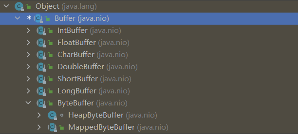

### 1. 缓冲区基础

缓冲区实质上是一个数组，缓冲区提供了对数据的结构化访问以及维护读写位置等信息

#### 1.1 属性

所有缓冲区都具有以下四个属性：

- capacity：缓冲区能够容纳的数据元素的最大数量，在缓冲区创建时指定，并且不能被修改
- limit：缓冲区的第一个不能被读或写的元素索引
- position：下一个要被读或写的元素索引
- mark：一个备忘位置，调用 _mark()_ 设定 mark = position，调用 _reset()_ 设定 position = mark

```java
public abstract class Buffer {
    // Invariants: mark <= position <= limit <= capacity
    private int mark = -1;
    private int position = 0;
    private int limit;
    private int capacity;
}
```

下图展示了一个新创建的 capacity 为 10 的 ByteBuffer：

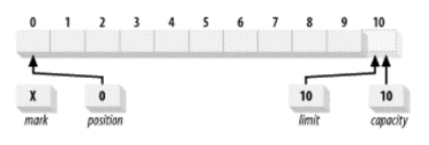

#### 1.2 Put

以 HeapByteBuffer 的其中两个 put 方法为例，下面是相关的代码片段：

```java
public abstract class Buffer {
    final int nextPutIndex() {                          // package-private
        int p = position;
        if (p >= limit)
            throw new BufferOverflowException();
        position = p + 1;
        return p;
    }
    
    final int checkIndex(int i) {                       // package-private
        if ((i < 0) || (i >= limit))
            throw new IndexOutOfBoundsException();
        return i;
    }
}
```


```java
public abstract class ByteBuffer extends Buffer implements Comparable<ByteBuffer> {
    final byte[] hb;                  // Non-null only for heap buffers
    final int offset;
    boolean isReadOnly;                 // Valid only for heap buffers
}
```


```java
class HeapByteBuffer extends ByteBuffer {
    protected int ix(int i) {
        return i + offset;
    }
    
    public ByteBuffer put(byte x) {
        hb[ix(nextPutIndex())] = x;
        return this;
    }

    public ByteBuffer put(int i, byte x) {
        hb[ix(checkIndex(i))] = x;
        return this;
    }
}
```

可以看出 `ByteBuffer put(byte x)` 这个方法会将 position 自增，而 `ByteBuffer put(int i, byte x)` 不会影响 position 的值

例如，在新建的缓冲区上执行以下代码：

```java
buffer.put((byte) 'H').put((byte) 'e').put((byte) 'l').put((byte) 'l').put((byte) 'o');
```

在五次调用 `ByteBuffer put(byte x)` 后，缓冲区的状态为：

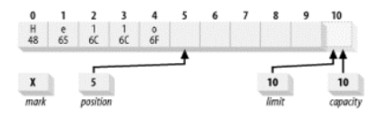

如果想要将缓冲区的内容从 "Hello" 修改为 "Mellow"，可以这样实现：

```java
// ByteBuffer put(int i, byte x) 不会影响 position 的值
buffer.put(0, (byte) 'M');

// ByteBuffer put(byte x) 会将 hb[position] 设为 x, 并且将 position 加 1
buffer.put((byte) 'w');
```

修改后的缓冲区如图所示：

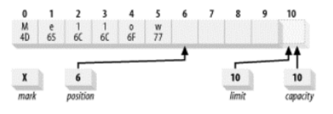

#### 1.3 Flip

flip() 函数可以将缓冲区从写状态转化为读状态，这其实就是通过修改位置信息实现的：

```java
public abstract class Buffer {
    public final Buffer flip() {
        limit = position;
        position = 0;
        mark = -1;
        return this;
    }
}
```

例如，对上述写入 "Mellow" 的缓冲区执行 flip 操作，缓冲区则从写状态转化为读状态：

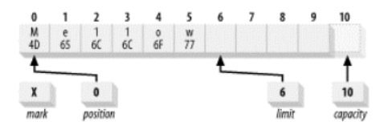

#### 1.4 Get

以 HeapByteBuffer 的其中两个 get 方法为例，其实现与 put 类似，下面是相关的代码片段：

```java
public abstract class Buffer {
    final int nextGetIndex() {                          // package-private
        int p = position;
        if (p >= limit)
            throw new BufferUnderflowException();
        position = p + 1;
        return p;
    }
    
    final int checkIndex(int i) {                       // package-private
        if ((i < 0) || (i >= limit))
            throw new IndexOutOfBoundsException();
        return i;
    }
}
```


```java
public abstract class ByteBuffer extends Buffer implements Comparable<ByteBuffer> {
    final byte[] hb;                  // Non-null only for heap buffers
    final int offset;
    boolean isReadOnly;                 // Valid only for heap buffers
}
```


```java
class HeapByteBuffer extends ByteBuffer {
    protected int ix(int i) {
        return i + offset;
    }

    public byte get() {
        return hb[ix(nextGetIndex())];
    }

    public byte get(int i) {
        return hb[ix(checkIndex(i))];
    }
}
```

除此之外，在缓冲区为读状态下：

- _remaining()_ 函数返回缓冲区中剩余的元素数量
- _hasRemaining()_ 判断缓冲区中是否还有可读的元素

在缓冲区为写状态下：

- _remaining()_ 函数返回缓冲区中还能写入的元素数量
- _hasRemaining()_ 判断缓冲区中是否还能继续写入元素

```java
public abstract class Buffer {
    public final int remaining() {
        int rem = limit - position;
        return rem > 0 ? rem : 0;
    }
    
    public final boolean hasRemaining() {
        return position < limit;
    }
}
```

因此，可以循环读取缓冲区中的内容：

```java
while (buffer.hasRemaining()) {
    buffer.get();
}
```

#### 1.5 Clear

一旦缓冲区对象经历了 Put -> Flip -> Get，它就可以被重新使用了，_clear()_ 函数将缓冲区重置为空状态，它并不改变缓冲区中的任何数据元素，而仅仅改变位置信息使得缓冲区可以被重新利用

```java
public abstract class Buffer {
    public final Buffer clear() {
        position = 0;
        limit = capacity;
        mark = -1;
        return this;
    }
}
```

#### 1.6 PutFlipGet Example

```java
package com.zhengjianting.nio.buffer;

import java.nio.CharBuffer;

public class BufferFillDrain {
    private static int index = 0;
    private static final String[] strings = {
            "A random string value",
            "The product of an infinite number of monkeys",
            "Hey hey we're the Monkees",
            "Opening act for the Monkees: Jimi Hendrix"
    };

    public static void main(String[] args) {
        CharBuffer buffer = CharBuffer.allocate(100);
        while (fillBuffer(buffer)) {
            buffer.flip();
            drainBuffer(buffer);
            buffer.clear();
        }
    }

    public static boolean fillBuffer(CharBuffer buffer) {
        if (index >= strings.length)
            return false;
        String string = strings[index++];
        for (int i = 0; i < string.length(); i++)
            buffer.put(string.charAt(i));
        return true;
    }

    public static void drainBuffer(CharBuffer buffer) {
        while (buffer.hasRemaining())
            System.out.print(buffer.get());
        System.out.println();
    }
}
```

#### 1.7 Compact

例如，向 buffer 写入 "Mellow" 之后执行 flip，从 buffer 中读取前两个字符 "Me"，缓冲区状态如下：

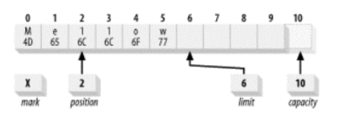

如果此时想继续向 buffer 内写入内容，那么就可以执行 _compact()_ 函数，以 HeapByteBuffer 为例：

```java
class HeapByteBuffer extends ByteBuffer {
    public ByteBuffer compact() {
        int pos = position();
        int lim = limit();
        assert (pos <= lim);
        int rem = (pos <= lim ? lim - pos : 0);
        System.arraycopy(hb, ix(pos), hb, ix(0), rem);
        position(rem);
        limit(capacity());
        discardMark();
        return this;
    }
}
```

以上图为例，compact 就是把 hb[2，6) 向前移动至 hb[0，4)，之后将 position 设为缓冲区内剩余的元素数量，即 lim - pos = 6 - 2 = 4，将 limit 设为 capacity，如图所示：

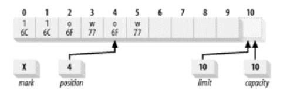

而此时，缓冲区也从读状态转换成了写状态

#### 1.8 Mark

mark 记录了一个 position，使得缓冲区可以在之后调用 _reset()_ 将 position 设为之前记录的 mark

```java
public abstract class Buffer {
    public final Buffer mark() {
        mark = position;
        return this;
    }
    
    public final Buffer reset() {
        int m = mark;
        if (m < 0)
            throw new InvalidMarkException();
        position = m;
        return this;
    }
}
```

#### 1.9 批量移动

除了一次读写一个元素，缓冲区还能批量读写，以 HeapByteBuffer 为例：

- `ByteBuffer get(byte[] dst, int offset, int length)` 表示从缓冲区读取 length 个元素，放置到 dst 数组中 ( 从 offset 开始放置 )
- `ByteBuffer put(byte[] src, int offset, int length)` 表示将 length 个 src 数组中的元素 ( 从 offse 开始 ) 写入到缓冲区中
- `ByteBuffer put(ByteBuffer src)` 表示把从 src 中读取的元素写入到缓冲区中

```java
class HeapByteBuffer extends ByteBuffer {
    public ByteBuffer get(byte[] dst, int offset, int length) {
        checkBounds(offset, length, dst.length);
        int pos = position();
        if (length > limit() - pos)
            throw new BufferUnderflowException();
        System.arraycopy(hb, ix(pos), dst, offset, length);
        position(pos + length);
        return this;
    }
    
    public ByteBuffer put(byte[] src, int offset, int length) {
        checkBounds(offset, length, src.length);
        int pos = position();
        if (length > limit() - pos)
            throw new BufferOverflowException();
        System.arraycopy(src, offset, hb, ix(pos), length);
        position(pos + length);
        return this;
    }

    public ByteBuffer put(ByteBuffer src) {
        if (src instanceof HeapByteBuffer) {
            if (src == this)
                throw new IllegalArgumentException();
            HeapByteBuffer sb = (HeapByteBuffer)src;
            int pos = position();
            int sbpos = sb.position();
            int n = sb.limit() - sbpos;
            if (n > limit() - pos)
                throw new BufferOverflowException();
            System.arraycopy(sb.hb, sb.ix(sbpos),
                             hb, ix(pos), n);
            sb.position(sbpos + n);
            position(pos + n);
        } else if (src.isDirect()) {
            int n = src.remaining();
            int pos = position();
            if (n > limit() - pos)
                throw new BufferOverflowException();
            src.get(hb, ix(pos), n);
            position(pos + n);
        } else {
            super.put(src);
        }
        return this;
    }
}
```

### 2. 创建缓冲区

除了 Boolean 类型，每一种 Java 基本类型都有对应的缓冲区类，它们都是抽象类，不能直接实例化，但是都包含静态工厂方法用来创建相应的类实例

以 ByteBuffer 为例，有以下创建缓冲区的静态工厂方法：

```java
public abstract class ByteBuffer extends Buffer implements Comparable<ByteBuffer> {
    public static ByteBuffer allocateDirect(int capacity) {
        return new DirectByteBuffer(capacity);
    }
    
    public static ByteBuffer allocate(int capacity) {
        if (capacity < 0)
            throw new IllegalArgumentException();
        return new HeapByteBuffer(capacity, capacity);
    }
    
    public static ByteBuffer wrap(byte[] array, int offset, int length) {
        try {
            return new HeapByteBuffer(array, offset, length);
        } catch (IllegalArgumentException x) {
            throw new IndexOutOfBoundsException();
        }
    }
    
    public static ByteBuffer wrap(byte[] array) {
        return wrap(array, 0, array.length);
    }
}
```

先不讨论 allocateDirect 方法，其它静态工厂方法创建的都是 HeapByteBuffer

#### 2.1 Allocate

以下代码从堆空间中分配了一个 byte 数组作为备份存储器 ( 缓冲区实质上是一个数组 )

```java
ByteBuffer byteBuffer = ByteBuffer.allocate(100);
```

#### 2.2 Wrap

以下代码构造了一个新的缓冲区对象，但数据元素会存在于数组中，这意味着通过调用 _put()_ 函数造成的对缓冲区的改动会直接影响这个数组，而且对这个数组的任何改动也会对这个缓冲区对象可见

```java
byte[] bytes = new byte[100];
ByteBuffer byteBuffer = ByteBuffer.wrap(bytes);
```

使用 `ByteBuffer wrap(byte[] array, int offset, int length)` 构造缓冲区对象会将 position 设为 offset，limit 设为 offset + length，例如：

```java
byte[] bytes = new byte[100];
ByteBuffer byteBuffer = ByteBuffer.wrap(bytes, 12, 42);
```

上述代码创建了一个 position 为 12，limit 为 54，capacity 为 100 的缓冲区对象

这个函数并不像您可能认为的那样，创建了一个只占用了一个数组子集的缓冲区，这个缓冲区可以存取这个数组的全部范围，offset 和 length 参数只是设置了初始状态，对上述 byteBuffer 调用 _clear()_ 函数，position 将变为 0，limit 将变为 100

如果 _hasArray()_ 函数返回 true 表示缓冲区有一个可存取的备份数组，可以通过 _array()_ 函数获得

```java
public abstract class Buffer {
    // Tells whether or not this buffer is backed by an accessible array.
    public abstract boolean hasArray();
    
    // Returns the array that backs this buffer  (optional operation).
    public abstract Object array();
}
```

### 3. 复制缓冲区

```java
public abstract class ByteBuffer extends Buffer implements Comparable<ByteBuffer> {
    public abstract ByteBuffer duplicate();
    public abstract ByteBuffer asReadOnlyBuffer();
    public abstract ByteBuffer slice();
}
```

#### 3.1 Duplicate

```java
class HeapByteBuffer extends ByteBuffer {
    public ByteBuffer duplicate() {
        return new HeapByteBuffer(hb, 
                                  this.markValue(), 
                                  this.position(), 
                                  this.limit(), 
                                  this.capacity(), 
                                  offset);
    }
}
```

以 ByteBuffer 为例，_duplicate()_ 创建一个新的 ByteBuffer：

- 它和调用 _duplicate()_ 的 ByteBuffer 共享一个 hb 数组
- 并且新的 ByteBuffer 的 capacity，limit，position，mark 属性和调用 _duplicate()_ 的 ByteBuffer 相同

由于本质上两个 ByteBuffer 共享同一个 hb 数组，因此其中一个 ByteBuffer 对缓冲区进行读写对另一个 ByteBuffer 可见

虽然复制时，新的 ByteBuffer 和 capacity，limit，position，mark 属性和调用 _duplicate()_ 的 ByteBuffer 相同，但是两个 ByteBuffer 的位置信息是相互独立的

例如，以下代码复制了一个缓冲区对象：

```java
ByteBuffer buffer = ByteBuffer.allocate(8);
buffer.position(3).limit(6).mark().position(5);
ByteBuffer dupeBuffer = buffer.duplicate();
buffer.clear();
```

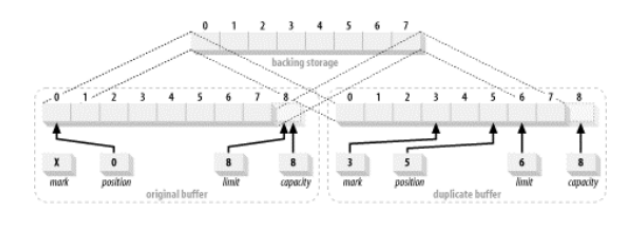

#### 3.2 AsReadOnlyBuffer

```java
class HeapByteBuffer extends ByteBuffer {
    public ByteBuffer asReadOnlyBuffer() {
        return new HeapByteBufferR(hb, 
                                   this.markValue(), 
                                   this.position(), 
                                   this.limit(), 
                                   this.capacity(), 
                                   offset);
    }
}
```

_asReadOnlyBuffer()_ 和 _duplicate()_ 一样都是创建一个新的缓冲区对象，新的缓冲区对象和调用 _asReadOnlyBuffer()_ 的缓冲区对象共享一个 hb 数组，但位置信息也是相互独立的

_asReadOnlyBuffer()_ 和 _duplicate()_ 唯一的区别是 _asReadOnlyBuffer()_ 创建的是只读缓冲区对象，不允许写操作，它调用 _isReadOnly()_ 返回 true，但是，对原来的 ByteBuffer 进行写操作是对新的 ByteBuffer 可见的

#### 3.3 Slice

```java
class HeapByteBuffer extends ByteBuffer {
    public ByteBuffer slice() {
        int pos = this.position();
        int lim = this.limit();
        int rem = (pos <= lim ? lim - pos : 0);
        return new HeapByteBuffer(hb, -1, 0, rem, rem, pos + offset);
    }
}
```

_slice()_ 也与 _duplicate()_ 类似，也是创建一个新的 ByteBuffer，但是 _slice()_ 创建的新的 ByteBuffer 和原始 ByteBuffer 共享一段 hb 数组的子序列，新的 ByteBuffer 的 position 为 0，limit 和 capacity 为原始 ByteBuffer 剩余的元素数量

例如，以下代码的执行结果如下：

```java
ByteBuffer buffer = ByteBuffer.allocate(8);
buffer.position(3).limit(5);
ByteBuffer sliceBuffer = buffer.slice();
```

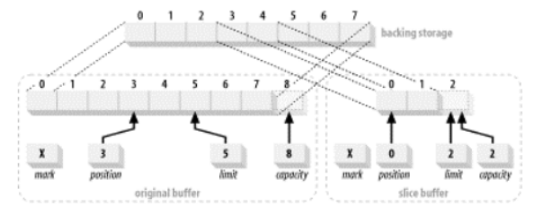

### 4. 字节缓冲区

#### 4.1 字节顺序

每个基本数据类型都是以连续字节序列的形式存储在内存中，多字节数值被存储在内存中的方式一般被称为 endian-ness ( 字节顺序 )，例如，32 位的 int 值 0x037fb4c7 在内存中有以下两种排列顺序：

- 大端字节顺序：数值的最高字节 —— big end ( 大端 )，位于低位内存地址

  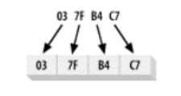

- 小端字节顺序：数值的最低字节优先保存在内存中

  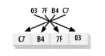

IP 协议规定了使用大端的网络字节顺序，所有在 IP 分组报文中的多字节数值必须先在本地主机字节顺序和通用的网络字节顺序之间进行转换

在 Java NIO 中，字节顺序由 ByteOrder 类封装：

```java
public final class ByteOrder {
    private String name;

    private ByteOrder(String name) {
        this.name = name;
    }
    
    public static final ByteOrder BIG_ENDIAN = new ByteOrder("BIG_ENDIAN");
    
    public static final ByteOrder LITTLE_ENDIAN = new ByteOrder("LITTLE_ENDIAN");
    
    public static ByteOrder nativeOrder() {
        return Bits.byteOrder();
    }
    
    public String toString() {
        return name;
    }
}
```

ByteOrder 类定义了从缓冲区中存储或检索多字节数值时使用哪一种字节顺序，其中 _nativeOrder()_ 静态函数返回 JVM 运行的硬件平台的固有字节顺序

- 通过 _allocate()_ 或者 _wrap()_ 创建的除了 ByteOrder 之外的其它缓冲区类，字节顺序是一个只读属性，_order()_ 返回与 ByteOrder.nativeOrder() 相同的值
- ByteBuffer 类有所不同：默认的字节顺序总是 ByteOrder.BIG_ENDIAN，无论 JVM 运行的硬件平台的固有字节顺序是什么，此外，ByteBuffer 的字节顺序可以通过调用 _order(ByteOrder bo)_ 来改变

#### 4.2 直接缓冲区

```java
public abstract class ByteBuffer extends Buffer implements Comparable<ByteBuffer> {
    public static ByteBuffer allocateDirect(int capacity) {
        return new DirectByteBuffer(capacity);
    }
    
    public abstract boolean isDirect();
}
```

#### 4.3 视图缓冲区

下面列出的每一个工厂方法都在原有的 ByteBuffer 对象上创建一个视图缓冲区，调用其中的任何一个方法都会创建对应的缓冲区类型对象，新的缓冲区对象维护它们自己的位置信息，但是和原来的缓冲区共享数据元素

```java
public abstract class ByteBuffer extends Buffer implements Comparable<ByteBuffer> {
    public abstract CharBuffer asCharBuffer();
    public abstract ShortBuffer asShortBuffer();
    public abstract IntBuffer asIntBuffer();
    public abstract LongBuffer asLongBuffer();
    public abstract FloatBuffer asFloatBuffer();
    public abstract DoubleBuffer asDoubleBuffer();
}
```

类似于 _slice()_ 函数，新的缓冲区是原始缓冲区的一个切分，其位置信息由原始缓冲区决定，新的缓冲区 mark = -1，position = 0，limit 和 capacity 为原始缓冲区中的元素数量除以相应的数据类型的字节数，以 HeapByteBuffer 为例，新的缓冲区的 limit 和 capacity 为下面代码中的 size，其中右移一位表示 Char 类型为 2 字节

```java
class HeapByteBuffer extends ByteBuffer {
    public CharBuffer asCharBuffer() {
        int pos = position();
        int size = (limit() - pos) >> 1;
        int off = offset + pos;
        return (bigEndian
                ? (CharBuffer)(new ByteBufferAsCharBufferB(this,
                                                               -1,
                                                               0,
                                                               size,
                                                               size,
                                                               off))
                : (CharBuffer)(new ByteBufferAsCharBufferL(this,
                                                               -1,
                                                               0,
                                                               size,
                                                               size,
                                                               off)));
    }
}
```

下面的代码创建了一个 ByteBuffer 缓冲区的 CharBuffer 视图：

```java
ByteBuffer byteBuffer = ByteBuffer.allocate(7).order(ByteOrder.BIG_ENDIAN);
CharBuffer charBuffer = byteBuffer.asCharBuffer();
```

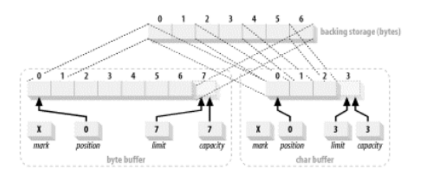

当一个视图缓冲区被创建时，视图会继承原始 ByteBuffer 对象的字节顺序，这个视图的字节顺序不能再被修改，字节顺序决定了 ByteBuffer 中的字节是以什么顺序被组合成 Char 变量的

#### 4.4 数据元素视图

ByteBuffer 类为每一种原始数据类型提供了相应的 _get()_ 和 _put()_ 方法：

```java
public abstract class ByteBuffer extends Buffer implements Comparable<ByteBuffer> {
    public abstract char getChar();
    public abstract char getChar(int index);
    public abstract short getShort();
    public abstract short getShort(int index);
    // ...
    
    public abstract ByteBuffer putChar(char value);
    public abstract ByteBuffer putChar(int index, char value);
    public abstract ByteBuffer putShort(short value);
    public abstract ByteBuffer putShort(int index, short value);
    // ...
}
```

以 char 为例，_getChar()_ 从 ByteBuffer 中读取 2 个字节，并根据 ByteBuffer 的字节顺序 ( 大端或小端 ) 转换成 char 变量，并将 position 加 2；_putChar()_ 根据 ByteBuffer 的字节顺序向其中写入一个 char 变量 ( 2 字节 )，并将 position 加 2

